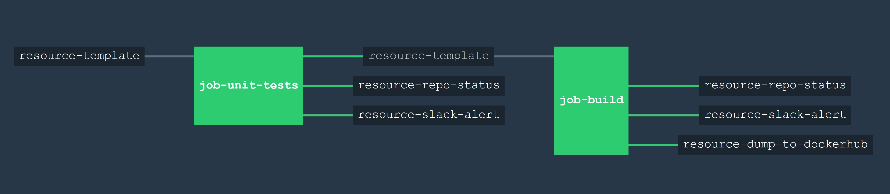

# resource-template

[](https://codeclimate.com/github/JeffDeCola/resource-template)
[](https://codeclimate.com/github/JeffDeCola/resource-template/issues)
[](https://goreportcard.com/report/jeffdecola/resource-template)
[](https://godoc.org/github.com/JeffDeCola/resource-template)
[](http://jeffdecola.mit-license.org)

`resource-template` _can be used as a tempalte in developing a concourse ci resource type while using concurse ci to test, build and push it to dockerhub._

## USE EITHER BASH SCRIPT OR GO FOR CHECK, IN, AND OUT

This resource type can use either bash script or go.

Change _ci/Dockerfile_ to either ADD _/assets-go_ or _/assets-bash_.

Default is bash script.

## SOURCE CONFIGURATION

These are just placeholders thatyou can update.

* `source1`: Just a placeholder.

* `source2`: Just a placeholder.

## BEHAVIOR

### CHECK

blah blah

### IN

blah blah

#### Parameters

* `param1`: Just a placeholder.

* `param2`: Just a placeholder.

### OUT

The script is all set to do something.

#### Parameters

* `param1`: Just a placeholder.

* `param2`: Just a placeholder.

## BUILT USING CONCOURSE CI

To automate the creation of the `resource-template` docker image, a concourse ci pipeline
will unit test, build and push the docker image to dockerhub.



A _ci/.credentials.yml_ file needs to be created for your _slack_url_, _repo_github_token_,
and _dockerhub_password_.

Use fly to upload the the pipeline file _ci/pipline.yml_ to concourse:

```bash
fly -t ci set-pipeline -p resource-template -c ci/pipeline.yml --load-vars-from ci/.credentials.yml
```

## CONCOURSE RESOURCES IN PIPELINE

As seen in the pipeline diagram, the _resource-dump-to-dockerhub_ uses the resource type
[docker-image](https://github.com/concourse/docker-image-resource)
to push a docker image to dockerhub.

`resource-template` also contains a few extra concourse resources:

* A resource (_resource-slack-alert_) uses a [docker image](https://hub.docker.com/r/cfcommunity/slack-notification-resource)
  that will notify slack on your progress.
* A resource (_resource-repo-status_) use a [docker image](https://hub.docker.com/r/dpb587/github-status-resource)
  that will update your git status for that particular commit.

These resources can be easily removed from the pipeline.